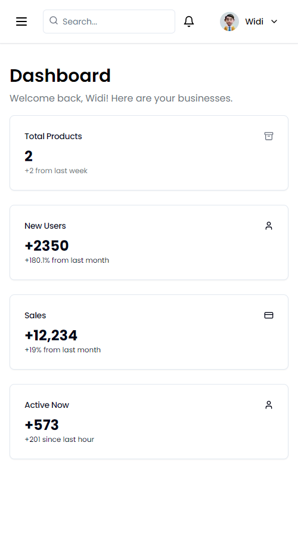
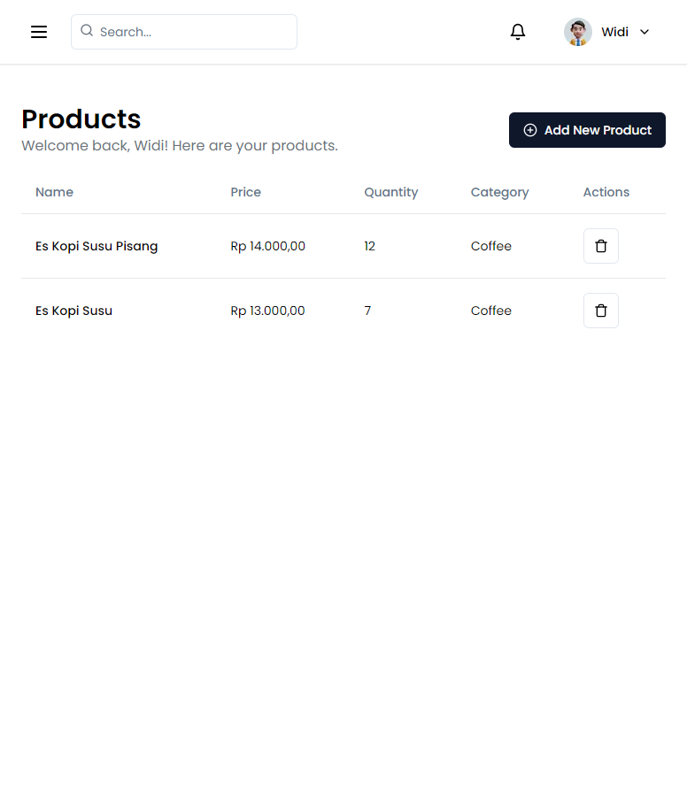

# Inventory Management System

## Deskripsi

Ini adalah aplikasi manajemen inventaris yang dibangun menggunakan Next.js dengan App Router (Typescript), NextAuth untuk autentikasi, Prisma sebagai ORM, dan MongoDB sebagai database. Aplikasi ini dirancang untuk membantu dalam mengelola stok barang, melacak item, dan mengelola pengguna.

## Fitur Utama

- Autentikasi pengguna dengan NextAuth
- Pengelolaan inventaris barang
- CRUD (Create, Read, Update, Delete) untuk item inventaris
- Integrasi dengan MongoDB menggunakan Prisma
- Navigasi berbasis App Router dari Next.js

## Prasyarat

- Node.js (versi 18.x atau yang lebih baru)
- MongoDB (versi 4.x atau yang lebih baru)

## Instalasi

1. **Clone Repository**

   ```bash
   git clone https://github.com/callmeeve/inventory-management.git
   cd inventory-management
   ```

2. **Instalasi Dependensi**

   Pastikan kamu sudah berada di direktori proyek, kemudian jalankan:

   ```bash
   npm install
   ```

3. **Konfigurasi Variabel Lingkungan**

   Salin file `.env.example` menjadi `.env` dan sesuaikan dengan konfigurasi MongoDB serta NextAuth:

   ```env
   DATABASE_URL=mongodb://localhost:27017/inventory
   NEXTAUTH_SECRET=your-nextauth-secret
   NEXTAUTH_URL=http://localhost:3000
   ```

   Sesuaikan `DATABASE_URL` dengan URI MongoDB yang kamu gunakan. `NEXTAUTH_SECRET` adalah string acak untuk keamanan autentikasi, bisa dihasilkan menggunakan `openssl rand -hex 32`.

4. **Migrasi Database**

   Jalankan perintah berikut untuk membuat tabel yang diperlukan oleh Prisma:

   ```bash
   npx prisma migrate dev --name init
   ```

5. **Menjalankan Aplikasi**

   Setelah semua konfigurasi selesai, jalankan aplikasi dengan perintah:

   ```bash
   npm run dev
   ```

   Akses aplikasi melalui `http://localhost:3000`.

## Screenshot

Berikut adalah beberapa tangkapan layar dari aplikasi:

### Halaman Utama


### Halaman Manajemen Item


### Halaman Login


## Penggunaan

### Autentikasi

Aplikasi menggunakan NextAuth untuk autentikasi. Kamu bisa login menggunakan kredensial yang telah dikonfigurasi dalam NextAuth. 

### Pengelolaan Inventaris

- **Menambah Item:** Akses halaman tambah item untuk menambahkan barang baru.
- **Mengedit Item:** Pilih item dari daftar untuk melakukan perubahan.
- **Menghapus Item:** Hapus item dari daftar dengan konfirmasi.

## Testing

Untuk menjalankan pengujian, pastikan semua dependensi telah terinstal dan jalankan:

```bash
npm test
```

## Kontribusi

Jika kamu ingin berkontribusi pada proyek ini, silakan fork repository ini dan kirim pull request dengan perubahan yang kamu buat. Jangan lupa untuk menambahkan deskripsi yang jelas mengenai perubahan yang kamu lakukan.

## Lisensi

Proyek ini dilisensikan di bawah [MIT License](LICENSE).

